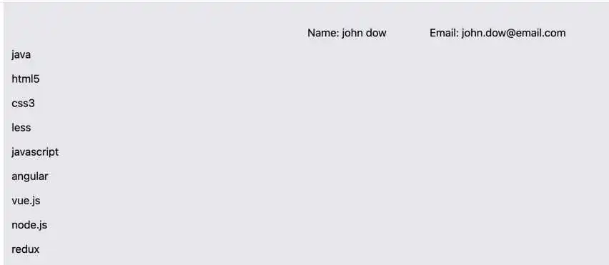

# resume_parser_py
## Description

This project utilizes the Flask web framework along with various Python packages to perform specific tasks efficiently. The goal of the project is to provide functionalities for handling PDF documents and performing text extraction using pdfminer. Additionally, it utilizes the powerful natural language processing capabilities of the `spacy` library.

## Packages Used

- **Flask**: Flask is a micro web framework in Python used to develop web applications. It provides a simple yet powerful way to handle HTTP requests, render templates, and manage routing.

- **spacy**: spacy is a popular NLP (Natural Language Processing) library in Python that offers advanced capabilities for text processing, including named entity recognition, part-of-speech tagging, dependency parsing, and more.

- **re**: The `re` module in Python provides support for regular expressions. It's used in this project to perform text pattern matching and manipulation.

- **pdfminer**: pdfminer is a library for extracting text and information from PDF documents. The project uses `pdfminer.high_level` to perform high-level text extraction from PDF files. It also utilizes `pdfminer.pdfparser` and `pdfminer.pdfdocument` to handle PDF-related exceptions and operations.

- **io**: The `io` module provides a convenient way to work with streams and file-like objects. In this project, `BytesIO` from the `io` module is used to handle binary data from PDF files.

## Installation

1. Clone this repository to your local machine.
2. Install the required packages using the following commands:
3. Run the application using `python app.py`.
4. Access the application by navigating to `http://localhost:5000` in your web browser.

